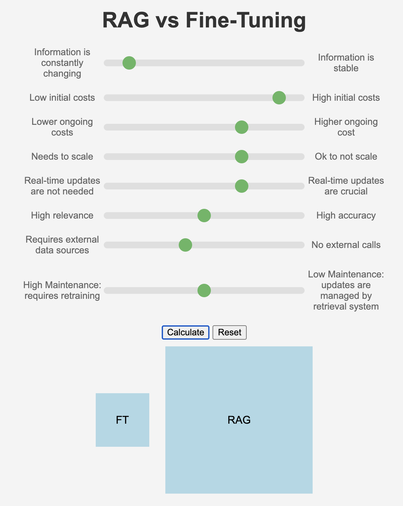

# RAG vs. Fine-Tuning Slider App

## Overview

This project is a web-based interactive tool designed to help users visually compare the suitability of Retrieval-Augmented Generation (RAG) versus Fine-Tuning. The app features sliders that adjust criteria relevant to the decision-making process and dynamically updates the size of "RAG" and "Fine-Tuning" boxes based on the selected values. In practice, using both fine-tuning and RAG together allows models to be more accurate and dynamic. For instance, a customer support AI could use RAG to pull real-time data and fine-tuning to ensure responses align with company policies.

## Features

- **Interactive Sliders**: Eight criteria sliders ranging from `-5` to `5` influence the size of the "RAG" and "Fine-Tuning" boxes.
- **Dynamic Visualization**: As sliders are adjusted, the boxes resize to indicate which approach (RAG or Fine-Tuning) is more suitable based on the selected criteria.
- **Reset Functionality**: A reset button appears after calculation, allowing users to revert the sliders and boxes to their default state.

## App

<div align="center">
  
</div>

## Requirements

- Python 3.x
- Flask

## Setup

1. **Clone the Repository**

   ```bash
   git clone https://github.com/UPatel12/RAG-vs-Fine-Tuning-Slider-App.git
   cd RAG-vs-Fine-Tuning-Slider-App

2. **Install Flask**
   ```bash
   pip install flask

4. **Run the Application**
   ```bash
   python app.py

6. **Access the App** <br>
   Open your web browser and go to http://localhost:5000

7. **Improvements** <br>
UX/UI: Improve the app's design, enhance visual hierarchy by increasing slider contrast, bolding key labels, and improving spacing. Modernize buttons with a fresh design and position them prominently. Introduce interactive feedback, tooltips, and consistent font sizes for better user experience. Apply a cohesive color scheme with color-coded sliders for intuitive use. Finally, make the results display dynamic with animated transitions and additional metrics for clearer comparisons. 


## Addition details 

This table helps you weigh the pros and cons of each approach based on different factors like cost, accuracy, latency, and the nature of the task. You can use it to guide your decision based on what’s most important for your specific use case. 


| **Factor**                        | **Fine-Tuning**                                                                 | **RAG (Retrieval-Augmented Generation)**                                           |
|-----------------------------------|----------------------------------------------------------------------------------|------------------------------------------------------------------------------------|
| **Nature of the Task**             | Suitable for specialized, stable tasks where the data doesn’t change frequently. | Suitable for tasks requiring up-to-date information or broad knowledge retrieval.  |
| **Initial Setup Cost**             | High due to the need for computational resources for training.                   | Lower, as no model retraining is needed, but requires setup of a retrieval system.  |
| **Ongoing Maintenance Cost**       | Low, as the model is ready to serve inferences directly.                         | Variable/moderate, depending on the frequency and complexity of retrievals.         |
| **Response Latency**               | Typically lower latency since the model generates responses directly.            | Potentially higher latency due to the additional step of retrieving information.    |
| **Accuracy & Relevance**           | High accuracy for the specific domain it was fine-tuned on, but less adaptable.  | High relevance for a wide range of topics, adaptable to new information.            |
| **Model Update Frequency**         | Requires re-fine-tuning for updates if the underlying data changes.              | Easier to update by changing the retrieval database or source, no retraining needed.|
| **Scalability**                    | Scales well for specific tasks after fine-tuning is completed.                   | Scales better for diverse tasks, especially where knowledge is dynamic.             |
| **Customization**                  | Highly customizable for a specific domain or task.                               | More general, can adapt to multiple domains without retraining.                     |
| **Use Case Examples**              | Ideal for industry-specific applications like medical diagnosis tools.           | Ideal for customer support, content generation with up-to-date information.         |
| **Data Privacy & Security**        | Better control over data since it’s all embedded within the fine-tuned model.    | Needs careful management of external data sources to ensure privacy and security.   |

